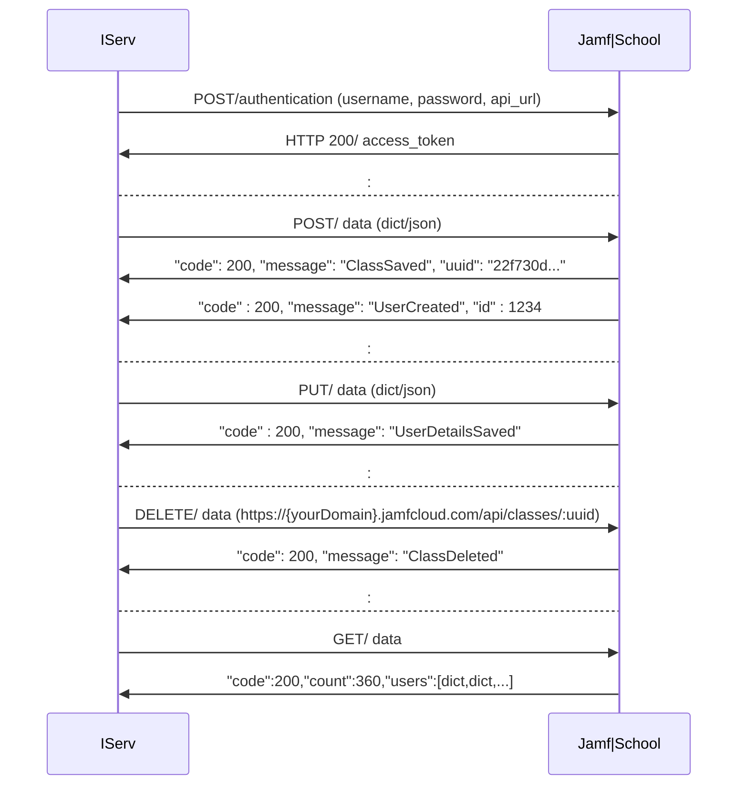
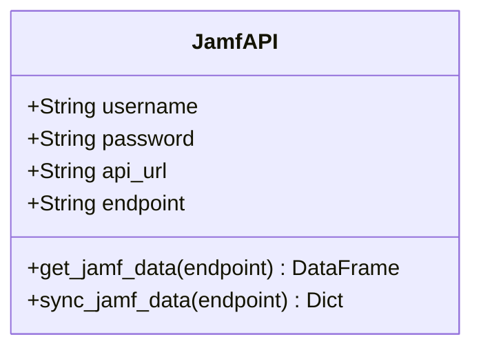
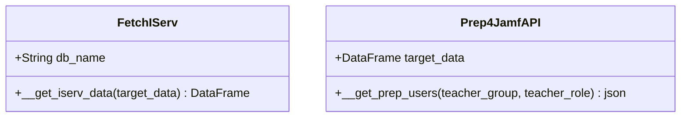

# Python-Jamfsync-IServ (Coming Soon!)
Python-Jamfsync-IServ is a powerful integration project designed to facilitate seamless communication between an IServ Schoolserver and the Jamf|School system via the Jamf|School APIv1. This project aims to provide a robust and efficient way to transfer user and group data, enabling schools to manage their systems more effectively.

### Project Overview:

Objective: The primary objective of Python-Jamfsync-IServ is to synchronize user and group data from an IServ Schoolserver to the Jamf|School system. This project emphasizes distinguishing between students and teachers, ensuring accurate and organized data transfer, and facilitating the creation of classes.

### Key Features:

JamfAPI Class: A dedicated class with a collection of variables and methods that directly map to the Jamf|School APIv1. This class is the core component that facilitates data retrieval and synchronization.

DataFrames Integration: The JamfAPI class connects to the Jamf|School APIv1 and retrieves data using DataFrames, allowing for efficient data handling and manipulation.

User and Group Synchronization: The project enables syncing of all IServ users and specific IServ groups. Groups that meet certain criteria on IServ are turned into classes on the Jamf|School system. 
By default, the group "lehrkraefte" is used to identify teachers on the IServ system. This default group can be modified to fit specific needs.
An alternative option is to use a role, such as "ROLE_TEACHER," to distinguish between teachers and students.
Future updates will include enhanced customization options, allowing administrators to set specific group characteristics for synchronization.

### Benefits:

Streamlined Data Management: Automate the transfer and synchronization of user and group data between IServ and Jamf|School, reducing manual effort and minimizing errors.

Enhanced Acceptance: Maintain a single point of management on IServ, allowing teachers to automatically receive the classes they teach and seamlessly manage their students' iPads without needing to be aware of the Jamf|School system.

Flexibility and Customization: Adapt the synchronization process to meet the unique needs of your school. Feel free to contact me with any requirements or suggestions to tailor the project to your specific needs. I will respond promptly, at least in the form of a comment.

Future Developments: This project is under active development, with plans to expand its functionality and customization options.

### Sketch: APIv1 Communiation - IServ & Jamf|School

#### Modeling: Basic classes

If the method `get_jamf_data` is used and no endpoint is specified, all available data is retrieved from the Jamf|School APIv1 and stored in accessible variables. Note that if an endpoint is specified, such as users, only the specified user's data will be returned in the custom variable.

Accessible data, i.e. class variables in JamfAPI are: 

    #--- ENDPOINTS --------------------------------------------------------
    # 1. users 2. devices 3. locations 4. profiles 5. apps 6. dep
    # 7. devicegroups 8. groups 9. teacher 10. ibeacons 11. classes
    # ---------------------------------------------------------------------

    # 1. Extract all data from Jamf|School APIv1
    jamf = JamfAPI(username=user, password=pwd, api_url=url, endpoint=None)
    
    # returns a pandas DataFrame with the current jamf users
    jamf.users

    # returns a pandas DataFrame with the current jamf classes
    jamf.classes

    # ...and so on...you get the idea ;-)

    # 2. Extract custom data from Jamf|School APIv1
    jamf = JamfAPI(username=user, password=pwd, api_url=url, endpoint='apps')

    # returns only one pandas DataFrame with the current jamf endpoint data
    jamf.custom 

Additionally, two supplementary classes are implemented. Firstly, the FetchIServ class, which retrieves the necessary data from the local database. Secondly, the Prep4JamfAPI class, which preprocesses the data to ensure it is ready for transfer and consumption by the JamfAPI.

