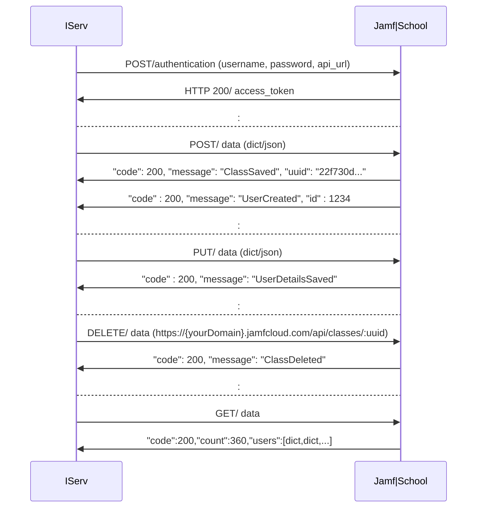
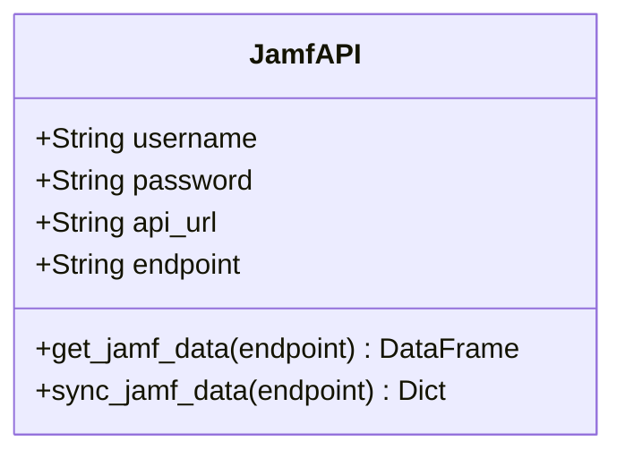
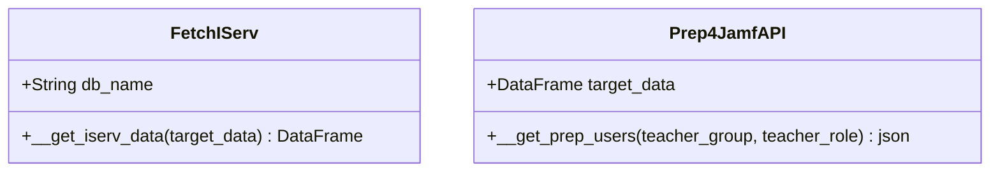

# python-jamfsync
<h4 style="color: orange;">Coming soon! This project is under construction.</h4>

Jamfsync is a Python 3 module for accessing the Jamf School APIv1. The APIv1 is the primary tool for accessing data on a Jamf|School system to enable integrations with other utilities or systems.
The concept behind this is to have a class or simply a collection of data (variables) and methods (functions) that map directly to the API (https://example.jamfcloud.com/api/).

The Jamfapi class connects to the Jamf|School APIv1 and retrieves data in the form of pandas DataFrames. In addition, all IServ users and certain IServ groups can be synced. The IServ groups are turned into classes on jamf|School. However, not all groups are synced as classes, but only those with the group characteristic ****, which can be set on the IServ.

The primary goal of the class is to transfer the user and group data from the school server IServ to the jamf School cloud and also to create classes in Jamf School, whereby a distinction is made between students and teachers.
The distinction is based on a group that uniquely identifies the teachers on the IServ. The default group is "lehrkreafte", which can be modified. If the group is not sufficient, you can also use a role such as "ROLE_TEACHER" to separate teachers and students.

#### Sketch: APIv1 Communiation - IServ & Jamf|School

#### Modeling: Basic classes

If the method `get_jamf_data` is used and no endpoint is specified, all available data is retrieved from the Jamf|School APIv1 and stored in accessible variables. Note that if an endpoint is specified, such as users, only the specified user's data will be returned in the custom variable.

Accessible data, i.e. class variables in JamfAPI are: 

    #--- ENDPOINTS --------------------------------------------------------
    # 1. users, 2. devices, 3. locations, 4. profiles, 5. apps, 6. dep
    # 7. devicegroups, 8. groups, 9. teacher, 10. ibeacons, 11. classes
    # ---------------------------------------------------------------------

    # 1. Extract all data from Jamf|School APIv1
    jamf = JamfAPI(username=user, password=pwd, api_url=url, endpoint=None)
    
    # returns a pandas DataFrame with the current jamf users
    jamf.users

    # returns a pandas DataFrame with the current jamf classes
    jamf.classes

    # ...and so on...you get the idea ;-)

    # 2. Extract custom data from Jamf|School APIv1
    jamf = JamfAPI(username=user, password=pwd, api_url=url, endpoint='apps')

    # returns only one pandas DataFrame with the current jamf endpoint data
    jamf.custom 

